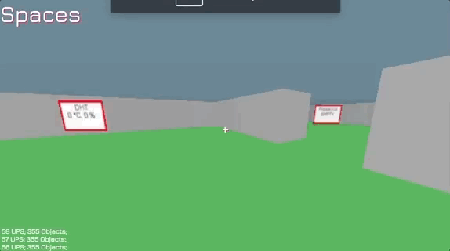

# Spaces
Reimagining the virtual-physical interface interconnect. Fading the boundary between physical and virtual.

Think of what MINECRAFT amalgamated with IOT would be, that is what this might be.

## See More
[LINK TO DEVPOST PROJECT](https://devpost.com/software/spaces-zv4bf0) 

## Inspiration
Automation right now stops at clunky mobile apps and cryptic interfaces. This doesn't have to be the case. What if you could have your home, office, or even factory, modelled and presented to you in 3D? What if you could control your electrical appliances and even monitor sensor readings in this virtual space, just as if you were really there in real life? And thus, Spaces, probably the smartest automation interface ever, was born.

## What it does 
Spaces is a human-machine interface that makes your smart automation appliances even easier to use. It is a 3D virtual space that allows you to control a real environment equipped with smart automation appliances, be it smart switches, sensors, or even other novel internet-of-things devices. Spaces even includes an easy to use 3D world generator that allows anyone to create the 3D virtual world that mirrors their own unique real environment quickly, frustration not included. Once set up, the possibilities are endless. You can toggle switches in the virtual space and the switch in the real environment will change too accordingly. You can install temperature sensors and monitor them anywhere in Spaces, even if you're halfway around the world. All these are presented to you in the 3D world exactly where the real switches and sensors are. That means no more frustration trying to remember what the switch named "Bedroom Light 7" is. It's just as if you were there, in real life.

## Built With
arduino
raspberry-pi
python
three.js
webGL
node.js
javascript
mqtt
debian
mac osX

SUTD What The Hack

